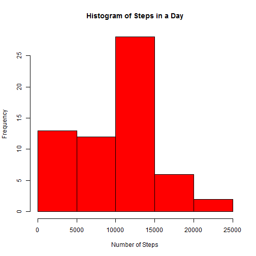
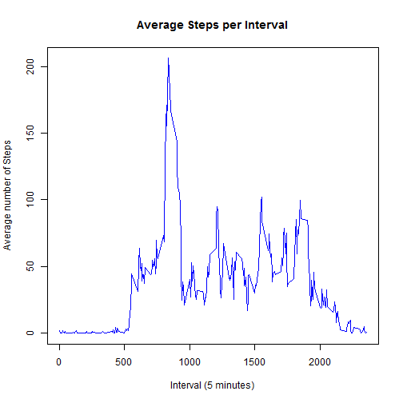
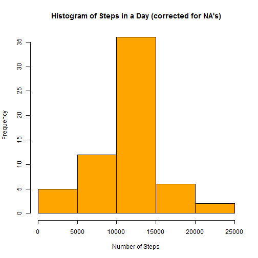
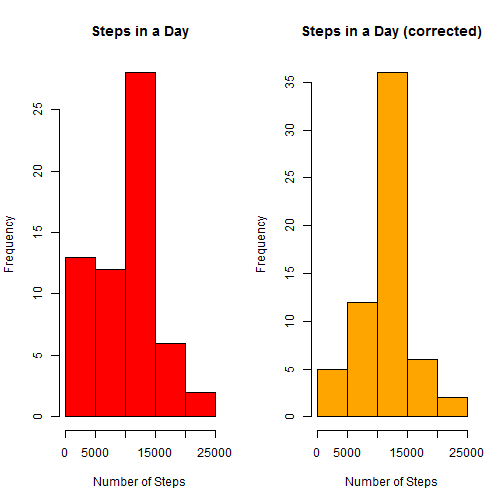
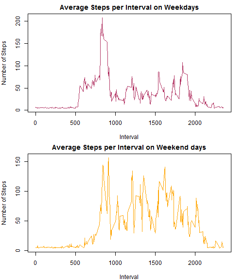

Refer to the Assignment (https://github.com/rdpeng/RepData_PeerAssessment1) fro details of this project.
The data is downloaded, unzipped and saved tot he working directory. THe septs follow


## Loading and processing the data


```r
# read the data from activity.csv file int he working directory
df1=read.csv(file="activity.csv")
str(df1)
```

```
## 'data.frame':	17568 obs. of  3 variables:
##  $ steps   : int  NA NA NA NA NA NA NA NA NA NA ...
##  $ date    : Factor w/ 61 levels "2012-10-01","2012-10-02",..: 1 1 1 1 1 1 1 1 1 1 ...
##  $ interval: int  0 5 10 15 20 25 30 35 40 45 ...
```

```r
library(lubridate)
df1$date=ymd(df1$date)
```

## What is mean total number of steps taken per day?


```r
stepsInaDay=tapply(df1$steps,df1$date,sum, na.rm=TRUE)
hist(stepsInaDay,col="red", main="Histogram of Steps in a Day",xlab="Number of Steps")
```

 

```r
meanStepsPerDay= round(mean(stepsInaDay, na.rm=TRUE),0)
medianStepsPerDay= median(stepsInaDay, na.rm=TRUE)
```

The mean total number of steps taken per day is 9354.   
The median of total number of steps taken per day is 10395.

## What is the average daily activity pattern?


```r
# gather data averaged per time segment, use tapply this time categorized by interval
# also included na.rm=TRUe, otherwise we will get NA for mean
y=tapply(df1$steps,df1$interval,mean,na.rm=TRUE)
plot(names(y),y,type="l",main="Average Steps per Interval",xlab="Interval (5 minutes)", ylab="Average number of Steps",col="blue")
```

 

```r
#Find the max where the max value occurs
ymax=which(y==max(y))
# ymax is an array with element number, interval interval value is the title int he array, which can be extracted with names function
z=names(ymax)
```

The averaged 5 minute interval with maximum number of steps is: 835

## Inputing Missing Values  

In this section we will replace the NA's with a meaningful value. I choose to replace NAs with random poisson variable with lambda=mean, mean is calculated for the whole data.


```r
numberOfNAs= sum(is.na(df1$steps))
mean_steps=mean(df1$steps,na.rm=TRUE)
df_new=df1
# created a new data frame by coping old one. Using for loop identifying eal value with NA and replacing it with a random Poisson value
for (i in 1:nrow(df1)) {
                if (is.na (df_new[i,1])) {
                        df_new[i,1]=round(rpois(1,mean_steps),0)
                        }
                }

#adding all steps and categorizing by day, plot a histogram of that data and calculate mean and median
stepsInaDay_new=tapply(df_new$steps,df_new$date,sum)
hist(stepsInaDay_new,col="orange", main="Histogram of Steps in a Day (corrected for NA's)",xlab="Number of Steps")
```

 

```r
meanStepsPerDay_new= round(mean(stepsInaDay_new),0)
medianStepsPerDay_new= median(stepsInaDay_new)               
```

Total Number of Rows with NAs are: 2304  
The mean total number of steps taken per day corrected for NAs is 1.0773 &times; 10<sup>4</sup>.     
The median of total number of steps taken per day corrected for NAs is 1.0799 &times; 10<sup>4</sup>.  

Correcting for NAs, changes mean by 1419.  
Correcting for NAs, changes median by 404.  

Since NAs are replaced with positive number, the total daily steps will increase compared to earlier calculations when NAs were ignored. That is clear from the two histograms below. Note the range of frequency in the two plots.   

Also note that the first bar of the Histogram (0 to 5000) is higher in first graph, compared to the second one. The obvious question how could the bar be lower in the second plot if we just added values for NAs. It turned out the first bar included 0s the answer returned by tapply function, when the NAs are replaced with meaningful values the all the elements with 0 values were assigned higher values, resulting in lower frequenct on 0 to 5000 bar.


```r
par(mfrow=c(1,2))
hist(stepsInaDay,col="red", main="Steps in a Day",xlab="Number of Steps")
hist(stepsInaDay_new,col="orange", main="Steps in a Day (corrected)",xlab="Number of Steps")
```

 

## Differences in activity patterns between weekdays and weekends  

Add a new column to categorize the data into weekday and weekend.  Then use the weekday function to extact the day, and classify it as week day or week end


```r
df_new$day=factor(c("weekday","weekend"))
for (i in 1:nrow(df_new)) {
        if (wday(df_new[i,2])==1 | wday(df_new[i,2])==7) {
        df_new$day[i]="weekend"
        } else {df_new$day[i]="weekday"}
        }
str(df_new)
```

```
## 'data.frame':	17568 obs. of  4 variables:
##  $ steps   : num  40 47 39 43 26 39 33 35 48 37 ...
##  $ date    : POSIXct, format: "2012-10-01" "2012-10-01" ...
##  $ interval: int  0 5 10 15 20 25 30 35 40 45 ...
##  $ day     : Factor w/ 2 levels "weekday","weekend": 1 1 1 1 1 1 1 1 1 1 ...
```

```r
weekday=subset(df_new,day=="weekday")
weekend=subset(df_new,day=="weekend")
y_weekday=tapply(weekday$steps,weekday$interval,mean)
y_weekend=tapply(weekend$steps,weekend$interval,mean)
par(mar=c(4,4,2,2))
par(mfrow=c(2,1))
plot(names(y_weekday),y_weekday,type="l",main="Average Steps per Interval on Weekdays",xlab="Interval", ylab="Number of Steps",col="maroon")
plot(names(y_weekend),y_weekend,type="l",main="Average Steps per Interval on Weekend days",xlab="Interval", ylab="Number of Steps",col="orange")
```

 
